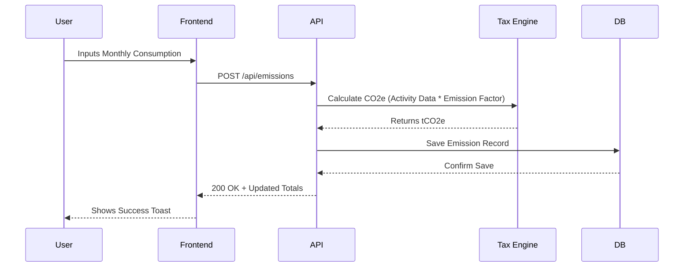

# 🏗️ Architecture Overview

The **CBAM Guard** architecture is designed to be **modular**, **scalable**, and **secure**, handling complex data relationships between industrial processes, emissions, and financial markets.

## 🧩 High-Level Design

The system follows a standard **Layered Architecture**:

1. **Presentation Layer (Frontend):** A responsive SPA built with React.
2. **API Layer (Backend):** A high-performance REST & WebSocket API built with FastAPI.
3. **Service Layer:** Encapsulates business logic (Tax calculation, AI processing).
4. **Data Access Layer:** Manages database interactions via SQLAlchemy ORM.
5. **Infrastructure Layer:** Databases, Caching, and Message Queues.

---

## 🛠️ Technology Stack

### Frontend Client

* **Framework:** [React 18](https://react.dev/) + [Vite](https://vitejs.dev/)
* **Language:** JavaScript (ES6+) / moving to TypeScript
* **Styling:** [Tailwind CSS](https://tailwindcss.com/) extended with the **Garanti BBVA Design System**.
* **State Management:** React Context API (for lightweight global state) + React Query (planned for server state).
* **Visualization:** [Recharts](https://recharts.org/) for high-performance SVGs.

### Backend API

* **Framework:** [FastAPI](https://fastapi.tiangolo.com/) (Python) - chosen for its speed and native async support.
* **Data Validation:** [Pydantic](https://docs.pydantic.dev/).
* **Authentication:** JWT (JSON Web Tokens) with OAuth2 password flow.
* **Real-time:** Native WebSockets for live notifications and ticker updates.

### Data & Persistence

* **Primary DB:** **PostgreSQL** (Production) / **SQLite** (Dev).
* **ORM:** **SQLAlchemy 2.0** (Async functionality).
* **Migrations:** **Alembic** for database schema versioning.

---

## 🔄 Core Data Flows

### 1. Emission Reporting Flow

How raw data becomes a compliant report:



### 2. AI Insight Generation (RAG)

How the AI Assistant provides context-aware answers:

```mermaid
graph LR
    User[User Question] --> API
    API --> VectorDB[Vectore Store (Projected)]
    VectorDB -->|Retrieve Context| Context[Relevant Regs]
    Context --> LLM[LLM Service]
    User --> LLM
    LLM -->|Generate Answer| Response
    Response --> API --> User
```

---

## 📂 Project Structure

A clean structure ensures that as the codebase grows, it remains navigable.

```bash
cbam-guard/
├── .github/                # CI/CD workflows
├── backend/
│   ├── app/
│   │   ├── api/            # Route handlers
│   │   ├── core/           # Config, Security, Events
│   │   ├── db/             # Database session & Base models
│   │   ├── models/         # SQLAlchemy models
│   │   ├── schemas/        # Pydantic schemas (Request/Response)
│   │   └── services/       # Complex business logic
│   ├── alembic/            # Migration scripts
│   └── tests/              # Pytest suites
├── frontend/
│   ├── src/
│   │   ├── assets/         # Static files (Images, Fonts)
│   │   ├── components/     # Atomic UI components
│   │   ├── config/         # App-wide constants
│   │   ├── contexts/       # React Context providers
│   │   ├── hooks/          # Custom React hooks
│   │   ├── layouts/        # Page scaffolding
│   │   ├── pages/          # Application views
│   │   └── services/       # API wrapper functions
└── docs/                   # You are here!
```

---

## 🔒 Security Measures

* **Role-Based Access Control (RBAC):** Users are assigned roles (Admin, Manager, Viewer, Supplier) limiting their access to endpoints.
* **Input Sanitization:** All request data is validated via Pydantic schemas to prevent injection attacks.
* **CORS Policy:** Strict Allow-Origin policies configured in FastAPI.
* **Secrets Management:** Environment variables (`.env`) used for all sensitive keys; never committed to git.
