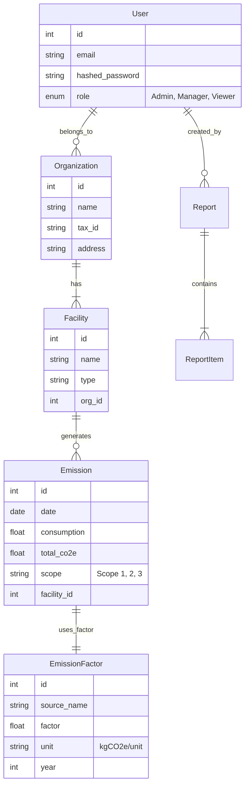

# 🗄️ Database Schema

CBAM Guard uses a relational database model to manage the complexities of emissions, reporting, and organizational structures.

## 📐 ER Diagram (Entity-Relationship)

## 📋 Table Details

### `users`

System users.

* `role`: Defines RBAC permissions.
* `is_active`: Soft delete mechanism.

### `emissions`

The core ledger of carbon activities.

* `consumption`: The raw activity data (e.g., 1000 m3 Gas).
* `total_co2e`: The calculated impact (Consumption * Factor).
* `scope`: Scope 1 (Direct), Scope 2 (Energy), Scope 3 (Supply Chain).

### `reports`

Generated compliance documents.

* `period`: The time range covered (e.g., "Q1 2024").
* `status`: Draft, Pending Approval, Submitted.
* `data_snapshot`: JSON blob storing the state of emissions at time of report generation (for immutability).
