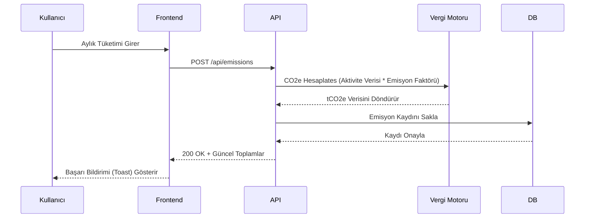
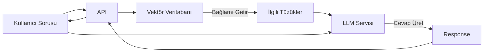

# 🏗️ Mimari Genel Bakış

**CBAM Guard** mimarisi, endüstriyel süreçler, emisyonlar ve finansal piyasalar arasındaki karmaşık veri ilişkilerini yönetmek üzere **modüler**, **ölçeklenebilir** ve **güvenli** olacak şekilde tasarlanmıştır.

## 🧩 Üst Düzey Tasarım

Sistem, standart bir **Katmanlı Mimari (Layered Architecture)** izler:

1. **Sunum Katmanı (Frontend):** React ile geliştirilmiş duyarlı bir Tek Sayfa Uygulaması (SPA).
2. **API Katmanı (Backend):** FastAPI ile geliştirilmiş yüksek performanslı REST & WebSocket API'si.
3. **Servis Katmanı:** İş mantığını (Vergi hesaplama, AI işleme) kapsüller.
4. **Veri Erişim Katmanı:** SQLAlchemy ORM aracılığıyla veritabanı etkileşimlerini yönetir.
5. **Altyapı Katmanı:** Veritabanları, Önbellekleme ve Mesaj Kuyrukları.

---

## 🛠️ Teknoloji Yığını (Tech Stack)

### Frontend (İstemci)

* **Framework:** [React 18](https://react.dev/) + [Vite](https://vitejs.dev/)
* **Dil:** JavaScript (ES6+) / TypeScript geçiş sürecinde
* **Stil:** [Tailwind CSS](https://tailwindcss.com/) + **Garanti BBVA Tasarım Sistemi**.
* **Durum Yönetimi:** React Context API (Hafif global durumlar için) + React Query (Sunucu durumu için planlanan).
* **Görselleştirme:** Yüksek performanslı SVG grafikleri için [Recharts](https://recharts.org/).

### Backend API

* **Framework:** [FastAPI](https://fastapi.tiangolo.com/) (Python) - Hız ve asenkron desteği için seçildi.
* **Veri Doğrulama:** [Pydantic](https://docs.pydantic.dev/).
* **Kimlik Doğrulama:** OAuth2 parola akışı ile JWT (JSON Web Tokens).
* **Gerçek Zamanlı:** Canlı bildirimler ve borsa takibi için Native WebSockets.

### Veri ve Kalıcılık

* **Ana Veritabanı:** **PostgreSQL** (Prod) / **SQLite** (Dev).
* **ORM:** **SQLAlchemy 2.0** (Asenkron işlevsellik).
* **Migrasyonlar:** Veritabanı şema versiyonlaması için **Alembic**.

---

## 🔄 Temel Veri Akışları

### 1. Emisyon Raporlama Akışı

Ham verinin uyumlu bir rapora dönüşme süreci:



### 2. AI İçgörü Oluşturma (RAG)

AI Asistanının bağlam duyarlı cevaplar vermesi:



---

## 📂 Proje Yapısı

Kod tabanı büyüdükçe yönetilebilir kalması için temiz bir yapı kullanıyoruz.

```bash
cbam-guard/
├── .github/                # CI/CD işlemleri
├── backend/
│   ├── app/
│   │   ├── api/            # Route işleyicileri
│   │   ├── core/           # Konfigürasyon, Güvenlik
│   │   ├── db/             # Veritabanı oturumu
│   │   ├── models/         # SQLAlchemy modelleri
│   │   ├── schemas/        # Pydantic şemaları
│   │   └── services/       # Karmaşık iş mantığı
│   ├── alembic/            # Migrasyon scriptleri
│   └── tests/              # Pytest testleri
├── frontend/
│   ├── src/
│   │   ├── assets/         # Statik dosyalar
│   │   ├── components/     # UI bileşenleri
│   │   ├── config/         # Uygulama sabitleri
│   │   ├── contexts/       # React Context sağlayıcıları
│   │   ├── hooks/          # Özel React hook'ları
│   │   ├── layouts/        # Sayfa şablonları
│   │   ├── pages/          # Uygulama ekranları
│   │   └── services/       # API fonksiyonları
└── docs/                   # Şu an buradasınız!
```

---

## 🔒 Güvenlik Önlemleri

* **Rol Tabanlı Erişim Kontrolü (RBAC):** Kullanıcılar Admin, Yönetici, İzleyici, Tedarikçi gibi rollere atanır.
* **Girdi Temizleme:** Tüm istek verileri Pydantic şemaları ile doğrulanır.
* **CORS Politikası:** FastAPI içinde sıkı "Allow-Origin" politikaları yapılandırılmıştır.
* **Gizli Anahtar Yönetimi:** Hassas anahtarlar için `.env` dosyası kullanılır; git'e asla gönderilmez.
