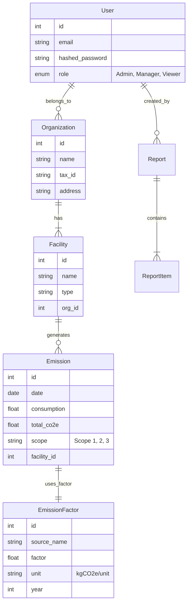

# 🗄️ Veritabanı Şeması

CBAM Guard, emisyonlar, raporlama ve organizasyonel yapıları yönetmek için ilişkisel bir veritabanı modeli kullanır.

## 📐 ER Diyagramı (Varlık-İlişki)

## 📋 Tablo Detayları

### `users` (Kullanıcılar)

Sistem kullanıcıları.

* `role`: RBAC izinlerini tanımlar.
* `is_active`: Soft delete (kullanıcıyı silmeden pasife alma) mekanizması.

### `emissions` (Emisyonlar)

Karbon aktivitelerinin ana defteri.

* `consumption`: Ham aktivite verisi (örn. 1000 m3 Gaz).
* `total_co2e`: Hesaplanan etki (Tüketim * Faktör).
* `scope`: Kapsam 1 (Doğrudan), Kapsam 2 (Enerji), Kapsam 3 (Tedarik Zinciri).

### `reports` (Raporlar)

Oluşturulan uyumluluk belgeleri.

* `period`: Kapsanan zaman aralığı (örn. "2024 1. Çeyrek").
* `status`: Taslak, Onay Bekliyor, Gönderildi.
* `data_snapshot`: Rapor oluşturulduğu andaki emisyon verilerinin JSON yedeği (değişmezlik için).
